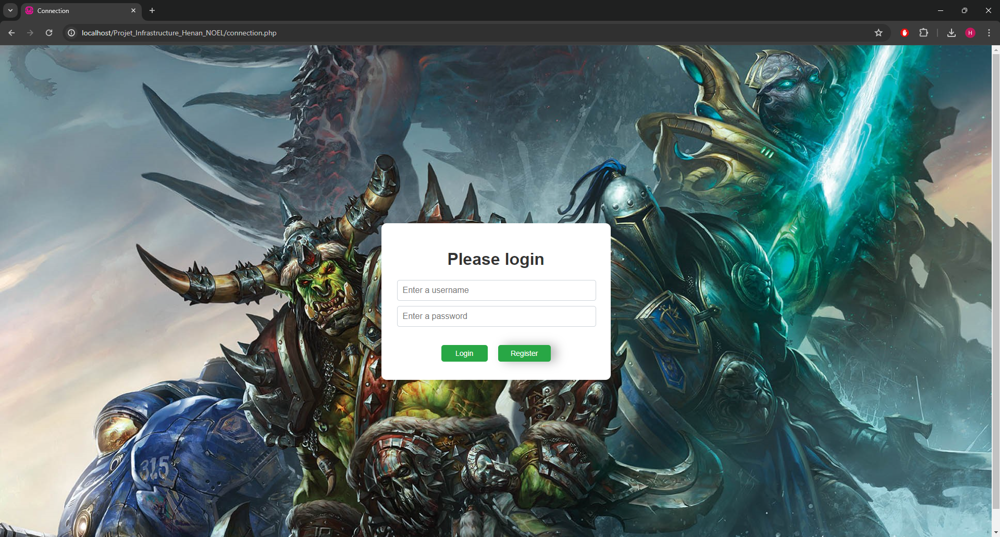
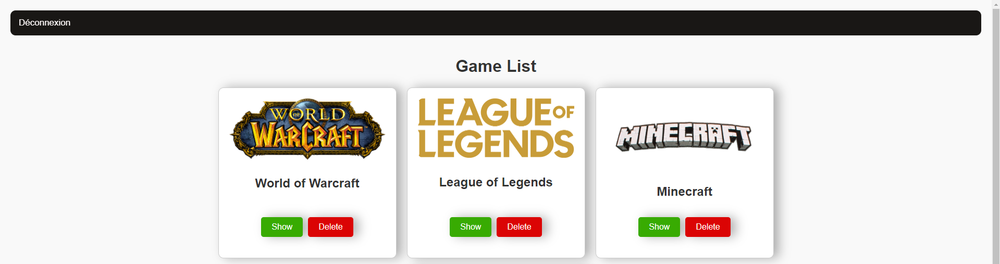
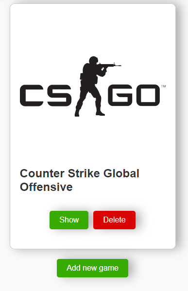

# Projet Infrastructure - Documentation

Projet réalisé par Hénan NOËL.

## Sommaire
I. [Rappel du Projet](#i-rappel-du-projet)  
II. [Cadre de développement](#ii-cadre-de-développement)  
III. [Stack Technique](#iii-stack-technique)  
IV. [Comment installer le projet](#iv-comment-installer-le-projet)  


## I. Rappel du Projet

Ce projet consistait a créer une base de données avec MariaDB via phpMyAdmin, permettre l'affichage des données contenues,
via un serveur codé en PHP, sur une site web garantissant la sécurité de l'utilisateur et son expérience.  

Le but complet était de pouvoir lister nos jeux vidéos avec notre évaluation personnelle sur ces jeux. Il fallait également
réaliser un CRUD (Create, Read, Update, Delete) permettant d'agir sur les jeux et la base de données depuis le site.

## II. Cadre de développement

- **Établissement** : Rennes Ynov Campus
- **Niveau d'études** : Première année en Bachelor Informatique
- **Contraintes** :
    *7 cours de 4h chacun : 28h
    *Travail en binôme (_non accompli par absence de mon binôme_)
    *Serveur sur un pc, et base de données sur l'autre

## III. Stack Technique

- **Langage** : PHP
- **Base de données** : MariaDB via PHPMyAdmin

## IV. Comment installer le projet

### 1 - Prérequis

Assurez-vous que XAMPP soit bien installé sur votre machine.
Une fois installé, démarrez les modules **Apache** et **MySQL**.

### 2 - Cloner le répertoire

Placez-vous dans le dossier **"htdocs"** de votre dossier XAMPP.
Ouvrez ensuite VisualStudioCode, ou votre IDE habituel, puis utilisez la commande ``git clone github.com/Utilisateur/NomDuRepo``.

### 3 - Configuration de la base de données

 - Accédez à PHPMyAdmin via l'interface de XAMPP : bouton _ADMIN_ sur la ligne _MySQL_.
 - Créez un nouvel utilisateur et lui assigner les privilèges nécessaires.
 - Créez une nouvelle base de données.
 - Sélectionnez votre nouvelle base de données.
 - Cliquez sur l'onglet **"Importer"** dans le menu principal en haut.
 - Cliquez sur **"Choisir un fichier"** et sélectionnez le fichier .sql que vous avez transféré.
 - Vérifiez les options d'importation. Les options par défaut devraient convenir.
 - Cliquez sur **"Exécuter"** pour lancer l'importation. PHPMyAdmin va lire le fichier .sql et recréer la structure et les données dans la nouvelle base de données.

### 4 - Configuration des credentials

 - Créez un fichier `db_config.php` dans le répertoire du projet avec le contenu suivant :
    ```php
    <?php
        $serveur = "localhost";
        $utilisateur = "Votre nom d'utilisateur";
        $mot_de_passe = "Son mdp";
        $base_de_donnees = "Le nom de votre base de données";
    ?>
    ```
 - Remplacez `"Votre nom d'utilisateur"`, `"Son mdp"`, et `"Le nom de votre base de données"` par les informations appropriées.

## V - Utilisation

Afin d'accéder à ce projet, ouvrez votre navigateur habituel et écrivez ``localhost/Projet_Infrastructure_Henan_NOEL``.
Pensez ensuite à vous créer un compte, connectez-vous et utilisez librement l'application qui vous est offerte.

Vous pouvez ajouter des jeux, modifier leurs informations, les supprimez... Vous êtes désormais libre !
Une fois terminé, pensez à vous déconnecter.

## VI - Visuels de l'application web

Voici la page que vous aurez lors de votre arrivée sur le site :  



Voici la page d'accueil du site :  



Et un exemple des options disponibles sur la page d'accueil :  

